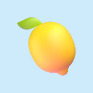

<div align="center">



# Piccolo Italiano

**An Italian game for children who can't read yet.**
Tap a picture, hear the word, find the right one, win a sticker.

### [▶ Play it here](https://paolacodes1.github.io/piccolo-italiano/piccolo-italiano/)

</div>

---

## Contents

- [Why this exists](#why-this-exists)
- [The idea in one minute](#the-idea-in-one-minute)
- [A full game, step by step](#a-full-game-step-by-step)
- [The six worlds and all 63 words](#the-six-worlds-and-all-63-words)
- [Portuguese help](#portuguese-help)
- [How the game chooses words](#how-the-game-chooses-words)
- [Design rules for a 4-year-old](#design-rules-for-a-4-year-old)
- [Put it on an iPad or iPhone](#put-it-on-an-ipad-or-iphone)
- [The grown-ups menu](#the-grown-ups-menu)
- [How it's built](#how-its-built)
- [Privacy](#privacy)
- [Troubleshooting](#troubleshooting)
- [Known limits](#known-limits)
- [Ideas for later](#ideas-for-later)
- [Credits](#credits)

---

## Why this exists

A 4-year-old in my family was learning Italian on a language app with his mom. It worked, but only while an adult sat next to him, because the app expects you to read. He can't read yet. I wanted him to be able to pick up the iPad and practice on his own.

So this game has one rule above all others: **nothing on the screen needs to be read.** Every instruction is spoken. Every button is a picture. The Italian words are written under the pictures for exposure, but the game never depends on them.

His mom is learning Italian too and isn't fluent, so the game also carries its own teacher: a recorded Italian voice for the words, and an optional Brazilian Portuguese voice that explains what's going on.

## The idea in one minute

1. **Pick a world.** Six big colored tiles: animals, colors, numbers, food, body, vehicles.
2. **Explore.** Inside a world, tap any picture to hear its name.
3. **Play.** Press the green ▶ button. The game teaches 3 words, then asks 6 "find it" questions.
4. **Win a sticker.** Every finished game adds a sticker to the album on the home screen.

A game takes about two minutes. There is no score, no timer and no way to lose.

## A full game, step by step

This is what a child hears and sees in the Animali world, with Portuguese help turned on. *Italics* are Italian, plain quotes are Portuguese.

| Moment | What he sees | What he hears |
|---|---|---|
| Opens the app | Lemon character, big green ▶ | "Oi! Vamos aprender italiano?" then *"Ciao! Giochiamo in italiano!"* |
| Taps the dog tile | A grid of 12 animals | "Os animais!" then *"Gli animali!"* |
| Taps the cat | The cat card bounces | "Gato é…" then *"Il gatto!"* |
| Presses ▶ | One big card: a cow | "Vamos aprender três palavras novas!" then "Vaca é…" then *"La mucca. La mucca."* |
| Presses the arrow twice | Two more big cards | The same pattern for the next two words |
| First question | Three pictures | "Agora escute, e toque na figura certa!" then *"Dov'è la mucca?"* |
| Taps the right one | Card turns green, stars fall | *"Bravissimo! La mucca!"* |
| Taps a wrong one | That card shakes and fades out | "Esse é o cavalo." then *"Il cavallo. Riprova! Dov'è la mucca?"* |
| Misses a second time | The right card wiggles | "Onde está a vaca?" then *"Dov'è la mucca?"* |
| After 6 questions | A big sticker spins in | "Você ganhou um adesivo!" then *"Finito! Bravissimo!"* |

With "Say his name" switched on (the default), the greeting, the ending and some of the praise include the child's name: *"Bravissimo, Francesco!"*

Things worth noticing:

- **A wrong answer teaches something.** Instead of a buzzer, he hears the name of what he tapped, in both languages.
- **He can't get stuck.** Wrong choices disappear, so by the third tap only the right answer is left.
- **The speaker button repeats the question** as many times as he wants.
- **The house button goes home** from anywhere.

## The six worlds and all 63 words

Nouns are taught with their article (*il gatto*, not *gatto*), so the gender comes along for free.

<details>
<summary><b>🐶 Animali</b> — 12 animals</summary>

| Italian | Portuguese |
|---|---|
| il cane | o cachorro |
| il gatto | o gato |
| il pesce | o peixe |
| l'uccello | o passarinho |
| la mucca | a vaca |
| il cavallo | o cavalo |
| il maiale | o porco |
| la pecora | a ovelha |
| il leone | o leão |
| l'elefante | o elefante |
| la rana | o sapo |
| il coniglio | o coelho |

</details>

<details>
<summary><b>🎨 Colori</b> — 10 colors</summary>

Shown as blobs of paint. The question is *"Dov'è il rosso?"*

| Italian | Portuguese |
|---|---|
| rosso | vermelho |
| blu | azul |
| giallo | amarelo |
| verde | verde |
| arancione | laranja |
| viola | roxo |
| rosa | rosa |
| nero | preto |
| bianco | branco |
| marrone | marrom |

</details>

<details>
<summary><b>🔢 Numeri</b> — 1 to 10</summary>

Shown as big colored numerals. The question is *"Dov'è il numero tre?"*

| Italian | Portuguese |
|---|---|
| uno | um |
| due | dois |
| tre | três |
| quattro | quatro |
| cinque | cinco |
| sei | seis |
| sette | sete |
| otto | oito |
| nove | nove |
| dieci | dez |

</details>

<details>
<summary><b>🍕 Cibo</b> — 12 foods</summary>

| Italian | Portuguese |
|---|---|
| la mela | a maçã |
| la banana | a banana |
| il pane | o pão |
| il formaggio | o queijo |
| la pizza | a pizza |
| il latte | o leite |
| l'uovo | o ovo |
| la fragola | o morango |
| la carota | a cenoura |
| il gelato | o sorvete |
| l'uva | a uva |
| la torta | o bolo |

</details>

<details>
<summary><b>👃 Corpo</b> — 9 body parts</summary>

| Italian | Portuguese |
|---|---|
| l'occhio | o olho |
| il naso | o nariz |
| la bocca | a boca |
| l'orecchio | a orelha |
| la mano | a mão |
| il piede | o pé |
| il dente | o dente |
| la gamba | a perna |
| il braccio | o braço |

</details>

<details>
<summary><b>🚗 Veicoli</b> — 10 vehicles</summary>

| Italian | Portuguese |
|---|---|
| la macchina | o carro |
| l'autobus | o ônibus |
| il treno | o trem |
| l'aereo | o avião |
| la barca | o barco |
| la bici | a bicicleta |
| il camion | o caminhão |
| l'elicottero | o helicóptero |
| il razzo | o foguete |
| il trattore | o trator |

</details>

## Portuguese help

The game is for a Portuguese-speaking child, so Portuguese is used as a guide and Italian stays the goal. Two rules keep the balance:

1. **Portuguese only explains.** Instructions, hints and the meaning of a new word come in Portuguese. The words to learn, the questions and the praise are always in Italian.
2. **Italian is always the last thing he hears.** Every spoken sequence ends in Italian, so that's what stays in his ear: "Gato é…" then *"Il gatto!"*, never the other way round.

Where Portuguese shows up:

| Situation | Portuguese line |
|---|---|
| First start | "Oi! Vamos aprender italiano?" |
| Opening a world (first 3 times) | "Toque nas figuras para ouvir. Quando quiser jogar, aperte o botão verde!" |
| A new word | "Gato é…" |
| Before the first question | "Agora escute, e toque na figura certa!" |
| First wrong tap | "Esse é o cachorro." |
| Second wrong tap | "Onde está o gato?" |
| End of a game | "Você ganhou um adesivo!" |

Portuguese help can be switched off in the grown-ups menu. The game then runs in Italian only.

## How the game chooses words

Each game teaches 3 words from the world he picked. They aren't random:

- **2 fresh words.** The ones he has gone longest without seeing, with a little randomness so the groups change from one pass to the next.
- **1 practice word.** The word he has missed most. If he hasn't missed any, a third fresh word takes its place.
- **No repeats in a row.** The 3 words from the last game in that world are left out of the next one.

Other details:

- A word counts as **missed** when his first tap on its question is wrong.
- A word **stops being a practice word** as he gets it right on the first try. Each clean answer cancels one miss.
- Each of the 3 words is asked **twice** per game, in mixed order, never twice in a row.
- The two wrong pictures in each question are picked at random from the same world.

In a 12-word world, every word comes up within about 5 games.

## Design rules for a 4-year-old

These shaped every screen:

- **Big targets.** Every button is large enough for a small, imprecise finger.
- **One thing per screen.** Pick a world, look at a word, or answer a question. Never two at once.
- **Sound for everything.** Each tap answers with a voice, a chime or a bounce.
- **No punishment.** A wrong tap gets a soft sound and a hint. There are no lives, red crosses or "game over".
- **A clear ending.** Six questions, then a sticker. Short sessions with a finish line beat an endless loop.
- **A character to talk to him.** The lemon moves its mouth whenever a voice is speaking, so the voice has a face.
- **Adults-only settings.** The settings open only by pressing and holding the small gear for about a second. A quick tap does nothing.

## Put it on an iPad or iPhone

1. Open the [game link](https://paolacodes1.github.io/piccolo-italiano/piccolo-italiano/) in **Safari**.
2. Tap **Share**, then **Add to Home Screen**.
3. A lemon icon called "Italiano" appears next to the other apps. It opens full screen, like a real app.

After the first visit the game is saved on the device and works without internet.

## The grown-ups menu

On the home screen, **press and hold the ⚙️** in the top corner for about a second.

| Setting | What it does |
|---|---|
| **Say his name** | Greets the child by name and uses it in about 1 of every 3 praises. The recorded name is Francesco (Francisco in the Portuguese lines). |
| **Portuguese help** | On, or Italian only. |
| **Voice** | "App voices" are the recorded clips. "This device's voice" uses the iPad's own text-to-speech instead. |
| **Speaking speed** | Slower or faster speech. |
| **Test voice** | Plays a sample line. |
| **Reset progress** | Erases stickers and word history on this device. Needs two taps, so it can't happen by accident. |

## How it's built

One HTML page, plain JavaScript, no framework and no build step on the server. It's a static site, which is why it can live on GitHub Pages for free.

```
index.html              the whole game: layout, styles, logic, pictures, word list
audio/common.json       shared voice clips: greetings, praise, instructions
audio/animali.json      voice clips for one world (one file per world)
audio/…
sw.js                   saves the files on the device so the game works offline
manifest.webmanifest    name, colors and icon for the home-screen app
icon-*.png              app icons
```

**Pictures.** 3D emoji from Microsoft's Fluent set, embedded directly in `index.html`. Every device shows the same art, instead of each one drawing emoji in its own style. Colors and numbers are drawn by the page itself.

**Voices.** All speech was generated once, ahead of time, with the open-source Kokoro voice model, then saved as small MP3 clips: 416 in total, one Italian voice and one Brazilian Portuguese voice. Nothing is generated while a child plays, so the game is fast, works offline and costs nothing to run.

Each word has six clips:

| Clip | Example for *il gatto* |
|---|---|
| the word in Italian | *"Il gatto."* |
| the question | *"Dov'è il gatto?"* |
| the word in Portuguese | "O gato." |
| the introduction | "Gato é…" |
| "this is…" for a wrong tap | "Esse é o gato." |
| the hint | "Onde está o gato?" |

The game builds every spoken sentence by playing clips one after another. That's how it can say "Bravissimo!" followed by any of 63 words without a recording for every combination.

**Loading.** The shared clips load first. Each world's clips load when the world is opened, and the rest are fetched quietly in the background.

**Fallback.** If a clip can't be loaded, the game speaks the same sentence with the device's built-in voice.

**Progress.** Stickers, settings and per-word history (right, missed, last seen) are stored in the browser on that device.

## Privacy

- No accounts and no sign-in.
- No ads.
- No analytics or tracking code.
- Nothing a child does in the game is sent anywhere. Progress never leaves the device.
- The page loads its typeface from Google Fonts. That's the only outside request.

## Troubleshooting

| Problem | Fix |
|---|---|
| **No sound** | Turn the volume up. On an iPhone, also flip the ringer switch on. |
| **The green ▶ on the first screen is grey** | The voices are still loading. Give it a few seconds. |
| **A word sounds wrong** | The voices are computer-generated and may mispronounce a word. Switch to "This device's voice" in the grown-ups menu, or open an issue here with the word. |
| **Stickers disappeared** | Progress is saved per device and per browser. Clearing Safari's website data erases it. |
| **Different stickers on the iPad and the iPhone** | Expected. Progress doesn't sync between devices. |
| **An update doesn't show** | Close the app fully and open it again. |

## Known limits

- **It doesn't listen.** The child never has to speak, because speech recognition is unreliable with small children. The game can't check his pronunciation.
- **Single words only.** No sentences or grammar yet.
- **One name.** The recorded name is fixed. Another child would need new clips, or the name switched off.
- **Computer voices.** They're clear, but they aren't a person.
- **One learning direction.** It's built for a Portuguese speaker learning Italian.

## Ideas for later

- Real recordings from a family member in place of the generated voice
- More worlds: family, clothes, weather, toys
- Tiny picture stories that reuse known words (*"Il gatto mangia la mela"*)
- A "say it out loud!" step that encourages speaking without grading it
- A progress page for parents

## Credits

- Pictures: [Microsoft Fluent Emoji](https://github.com/microsoft/fluentui-emoji), MIT License
- Voices: generated with [Kokoro](https://github.com/hexgrad/kokoro), Apache 2.0 License
- Typeface: [Baloo 2](https://fonts.google.com/specimen/Baloo+2), Open Font License

---

<div align="center">

Made with love for one small Italian learner. *In bocca al lupo!*

</div>
